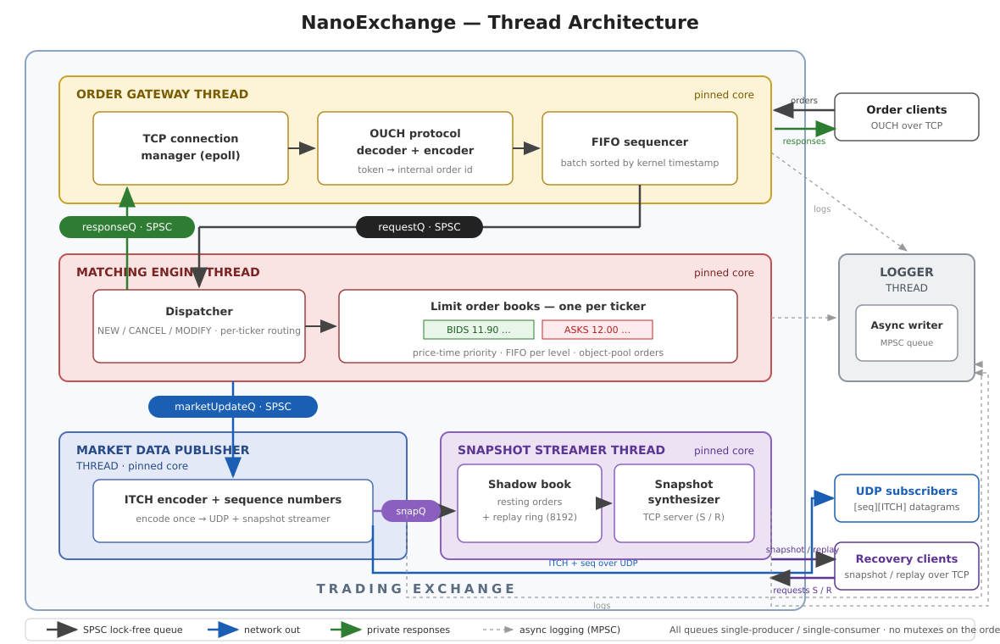
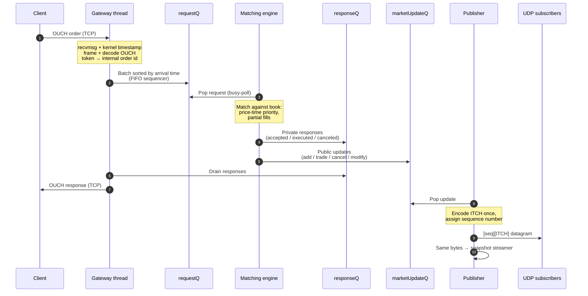
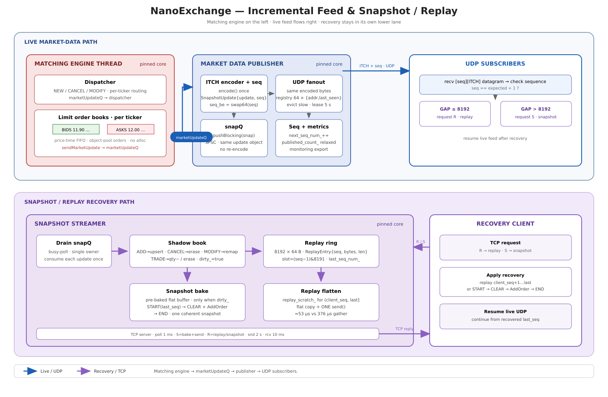

# NanoExchange

NanoExchange is a low-latency, single-venue electronic exchange written in C++20.
Clients enter orders as **OUCH** messages over **TCP**, orders are matched with
**price-time priority**, and public market data is published as **ITCH** messages
over **UDP** with TCP snapshot/replay recovery for missed data.

The design goal is a measurable exchange-engine prototype: a small hot path,
**no mutexes on the order path**, and one thread per stage connected by lock-free
SPSC queues. Queues, logging, thread pinning, socket helpers, object pools, and
wire-format definitions come from the vendored
[QuantLink](https://github.com/Yashwanth-1412/QuantLink) submodule.

## Architecture

The exchange runs five threads: three on the hot path (gateway, matching engine,
market-data publisher) and two auxiliary (snapshot/recovery streamer, logger).



Three logical data planes cross the thread boundaries:

1. **Order entry:** client → gateway → matching engine
2. **Private responses:** matching engine → gateway → originating client
3. **Public market data:** matching engine → publisher → UDP subscribers and the
   snapshot/replay service

Key properties:

- Every inter-thread hand-off is a single-producer / single-consumer lock-free
  ring. No locks, no condition variables — consumers busy-poll.
- Each thread is pinned to its own physical core (`/proc` placement is printed
  at startup).
- Messages are cache-line-sized (`MEClientRequest` is exactly 64 bytes, enforced
  by `static_assert` in `src/types.h`).
- Backpressure policy is asymmetric: the engine **blocks** when writing
  responses/updates (a fill is never dropped); the gateway **retains and
  retries** requests when the engine queue is full; the publisher **evicts**
  slow UDP subscribers so they cannot throttle the feed.

## Order lifecycle



Details that matter:

- **Framing:** OUCH messages are fixed-size per message type, so the gateway
  uses the type byte and a size table — it never trusts a wire length field.
- **FIFO sequencing:** within one epoll round, requests from different clients
  are staged, then sorted by **kernel receive timestamp** before entering
  `requestQ`. Order priority never depends on the order epoll returns fds.
- **Tokens:** the client's 14-byte OUCH token is scoped per client (one client
  cannot cancel another's order) and rides on the request, the resting order,
  and every response — response encoding never needs a reverse lookup.

## Order books

Two implementations share one compile-time facade
(`src/engine/order_book/order_book.h`) — no virtual dispatch:

| | Map book (default) | Vector book |
|---|---|---|
| Structure | `std::map<Price, PriceLevel>` per side | Dense `PriceLevel` array per side, indexed by price |
| Best price | `begin()` | Cached `best_bid_` / `best_ask_` pointers |
| Memory | Proportional to live levels | Full price range reserved (256k levels/side) |
| Binary | `NanoExchange` | `NanoExchangeVector` |

Both maintain identical semantics: price-time priority, FIFO within a level,
partial fills, GTC and FAK orders, cancel/replace, and OUCH token propagation.
Resting orders come from an object pool — no allocation on the hot path.

## Market data and recovery

The publisher assigns every update a monotonically increasing sequence number
and sends one datagram per update:

```text
[ 8-byte big-endian sequence number ][ ITCH payload ]
```

The same encoded bytes go to UDP subscribers and to the snapshot streamer,
which keeps a **shadow book** of all resting orders and a **replay ring** of the
last 8192 sequenced updates. Recovery clients connect over TCP:



- **`R` (replay):** streamer answers `C` (already current), `N` (gap too large →
  client falls back to snapshot), or `R` followed by the missing frames in one
  `send()`.
- **`S` (snapshot):** a pre-baked buffer — `SNAP_CTRL_START(last_seq)`, per
  ticker `SNAP_CTRL_CLEAR(ticker)` + every resting order re-encoded as an ITCH
  AddOrder, then `SNAP_CTRL_END(last_seq)` — sent in a single write. The buffer
  is only re-baked when the book changed, so the common case is one syscall.
- **Isolation:** recovery clients get send timeouts; a stuck client is dropped
  and can never stall the live feed. Slow UDP subscribers are evicted.

## Protocols

OUCH/ITCH wire structs live in `QuantLink/Lib/protocol/`; encode/decode logic in
`src/network/protocol/`. Both are fixed-layout, big-endian formats.

**OUCH (order entry, TCP)** — supported subset:

| Direction | Message | Type byte |
|---|---|---|
| Client → Exchange | Enter Order | `O` |
| Client → Exchange | Cancel Order (full or partial) | `X` |
| Client → Exchange | Replace Order | `U` |
| Exchange → Client | Order Accepted | `A` |
| Exchange → Client | Order Executed | `E` |
| Exchange → Client | Order Canceled | `C` |
| Exchange → Client | Order Replaced | `U` |
| Exchange → Client | Cancel Rejected | `J` |

Time-in-force: OUCH TIF 0 maps to **fill-and-kill**, non-zero to
**good-till-cancel**. Prices are 32-bit fixed-point (4 decimal places).

**ITCH (market data, UDP + snapshot stream):**

| Update | ITCH message | Type byte |
|---|---|---|
| Order added to book | Add Order | `A` |
| Trade | Order Executed (with match number) | `E` |
| Order removed | Order Delete | `D` |
| Order replaced | Order Replace | `U` |

ITCH timestamps are the 6-byte nanoseconds-since-midnight field, packed
manually. Snapshot control markers (`SNAP_CTRL_START/CLEAR/END`) are carried
inside Order Delete frames with reserved `stock_locate` values, so snapshot
bytes remain valid ITCH framing.

## Repository layout

```text
NanoExchange/
├── CMakeLists.txt
├── QuantLink/                    # vendored submodule: queues, logger, sockets,
│                                 #   object pools, OUCH/ITCH wire structs
├── docs/structure.txt            # historical design sketch (not current arch)
├── scripts/                      # perf runner, packaging, visualization
├── src/
│   ├── main.cpp                  # wiring: queues, threads, pinning, shutdown
│   ├── types.h                   # domain messages + cache-line static_asserts
│   ├── instrumentation/perf_utils.h
│   ├── engine/
│   │   ├── matching_engine.*     # per-ticker dispatch, busy-poll loop
│   │   └── order_book/           # map + vector LOB behind compile-time facade
│   └── network/
│       ├── gateway/              # order_server, fifo_process, token_manager
│       ├── market/               # marketdata_publisher, snapshot_stream
│       └── protocol/             # ouch_processor, itch_encoder
└── tests/                        # correctness tests + stress benchmarks
```

## Build

Requirements: Linux, C++20 compiler, CMake ≥ 3.15, git submodules initialized.

```bash
git submodule update --init --recursive   # if QuantLink/ is empty
cmake -S . -B build
cmake --build build -j
```

Builds with `-O3 -march=native` — binaries are tuned for the build machine.

| Target | Description |
|---|---|
| `NanoExchange` | Exchange with the map order book |
| `NanoExchangeVector` | Exchange with the vector order book |

## Run

```text
NanoExchange <gateway_iface> <gateway_port>
             <incremental_ip> <incremental_port>
             <snapshot_tcp_port> <feed_iface>
             [core_me] [core_gateway] [core_publisher] [core_streamer] [core_logger]
```

Loopback example with default core placement (1, 2, 4, 6, 8):

```bash
./build/NanoExchange lo 21000 127.0.0.1 21001 21003 lo
```

Pass `-1` for any core to leave scheduling to the OS. `SIGINT`/`SIGTERM` shut
down in reverse order (gateway → engine → publisher) so queues drain safely.

## Tests and benchmarks

| Binary | What it covers |
|---|---|
| `me_test` | Engine-level scenarios: fills, sweeps, FAK, cancel/replace, FIFO fairness, multi-ticker |
| `ob_test` | Vector order-book correctness + perf |
| `ob_compare` | Map vs vector stress benchmark (deep books, sweeps, flash-crash, …) |
| `test_protocol_price` | OUCH/ITCH fixed-point price round-trip |
| `test_queue_backpressure` | FIFO sequencer retention and ordered retry when `requestQ` is full |
| `cache_line_benchmark` | Queue payload-size / false-sharing experiments |
| `integration_test` | Interactive loopback demo (not a pass/fail test) |

```bash
./build/me_test && ./build/ob_test && ./build/test_protocol_price \
  && ./build/test_queue_backpressure
./build/ob_compare | tee ob_compare.log
```

## Known limitations

- Single matching-engine thread, fixed ticker count, no persistence/journal.
- Vector book requires prices below `MAX_PRICE_LEVELS` (256000).
- UDP delivery is best-effort by design — clients must use sequence numbers and
  the snapshot/replay recovery path.
- The wire protocol surface is a focused OUCH/ITCH subset, not a full venue.
