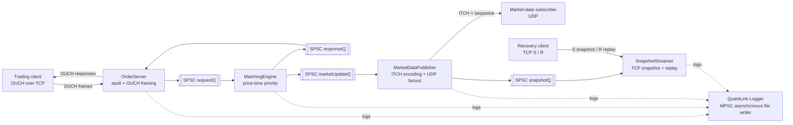
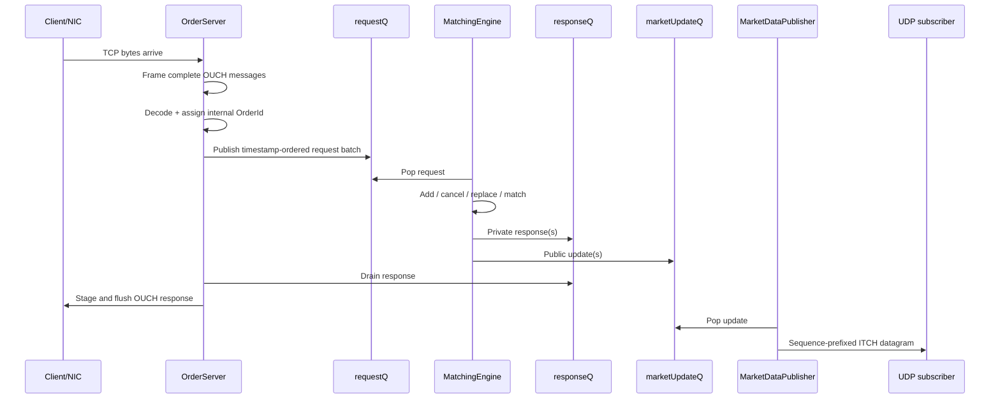
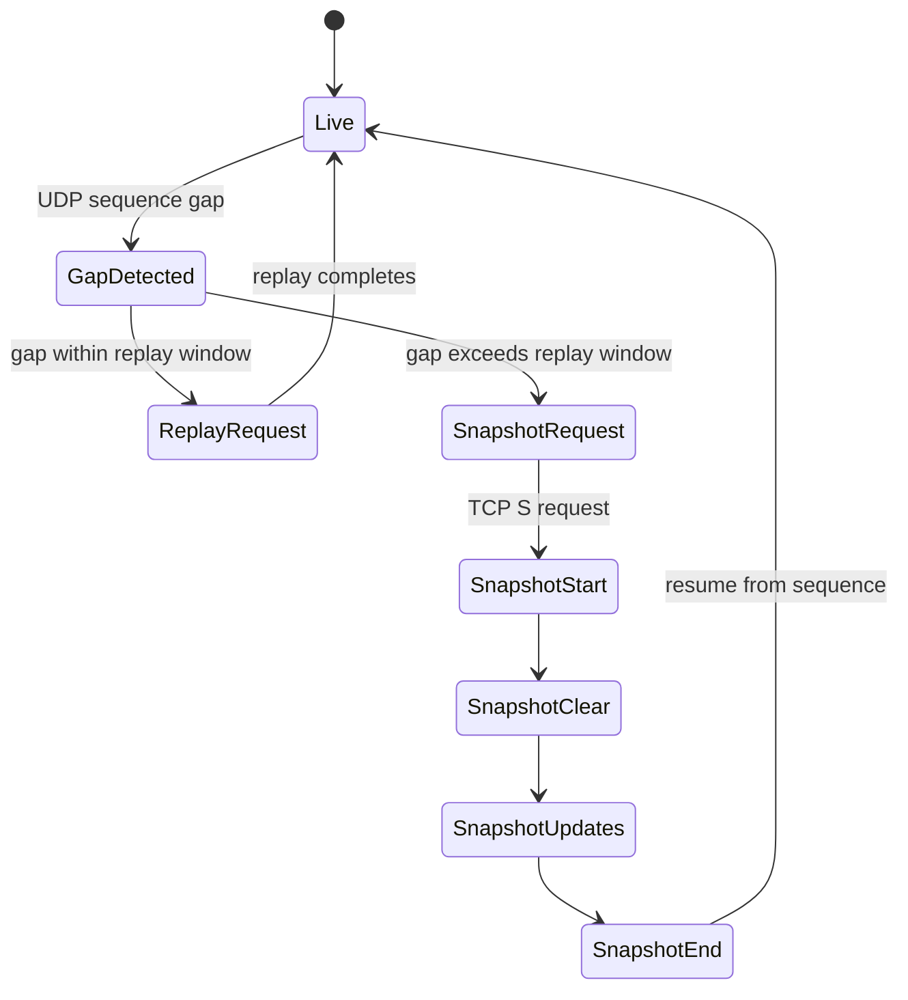

# NanoExchange

NanoExchange is a low-latency single-venue electronic exchange written in C++20.
It accepts OUCH order-entry messages over TCP, matches orders using price-time
priority, publishes ITCH market data over UDP, and provides TCP snapshot/replay
recovery.

The project is designed as a measurable exchange-engine prototype rather than a
production venue. The hot path is intentionally small: one gateway thread, one
matching-engine thread, one market-data thread, one snapshot/replay thread, and
one asynchronous logger connected by lock-free SPSC queues.

NanoExchange uses [QuantLink](https://github.com/Yashwanth-1412/QuantLink) as a
vendored submodule for queues, logging, thread pinning, socket helpers, object
pools, and wire-format message definitions.

## Contents

- [Architecture](#architecture)
- [Thread and queue model](#thread-and-queue-model)
- [Order lifecycle](#order-lifecycle)
- [Order books](#order-books)
- [Market data and recovery](#market-data-and-recovery)
- [Protocols](#protocols)
- [Repository layout](#repository-layout)
- [Build](#build)
- [Run](#run)
- [Tests and benchmarks](#tests-and-benchmarks)
- [Performance tooling](#performance-tooling)
- [Configuration and invariants](#configuration-and-invariants)
- [Known limitations](#known-limitations)

## Architecture

The exchange has three primary data planes:

1. **Order entry:** OUCH/TCP from clients to the gateway, then to the matching engine.
2. **Private responses:** execution, acceptance, cancellation, and replacement responses back to the originating client.
3. **Public market data:** ITCH updates to UDP subscribers and the snapshot/replay service.



There is no mutex on the normal order path. Each queue has one producer and one
consumer, and ownership is deliberately separated by thread.

## Thread and queue model

The default process contains these logical stages:

| Stage | Owner | Input | Output | Responsibility |
|---|---|---|---|---|
| Gateway | `OrderServer` | TCP sockets | `requestQ`, socket output buffers | Accept clients, frame/decode OUCH, sequence requests, encode responses |
| Matching | `MatchingEngine` | `requestQ` | `responseQ`, `marketUpdateQ` | Route by ticker and apply matching rules |
| Publisher | `MarketDataPublisher` | `marketUpdateQ` | UDP subscribers, snapshot queue | Encode ITCH, assign sequence numbers, fan out updates |
| Recovery | `SnapshotStreamer` | snapshot queue, TCP recovery sockets | TCP clients | Maintain shadow state and serve snapshot/replay |
| Logging | QuantLink `Logger` | MPSC log queue | `nanoexchange.log` | Serialize asynchronous diagnostics |



### Startup and shutdown

Startup is ordered so downstream consumers exist before upstream producers run:

```text
start: publisher -> matching engine -> gateway
stop:  gateway   -> matching engine -> publisher
```

On shutdown, the gateway stops accepting new orders first. The matching engine
then stops, and the publisher is stopped last so downstream market-data work can
drain as far as the current shutdown policy allows.

## Order lifecycle

### 1. Network arrival and framing

`OrderServer` polls TCP sockets using QuantLink socket wrappers. OUCH messages are
fixed-size by message type, so framing uses the leading message byte and a size
table rather than trusting a network-provided length field.

### 2. Decode and identity

`ouch_processor.h` decodes wire messages into `MEClientRequest`. The gateway's
`OrderTokenManager` maps the client-scoped OUCH token to an internal order ID.
The raw 14-byte token is carried on the request and later copied to responses.

Tokens are scoped by client/session, not globally. This prevents one client from
canceling another client's order by reusing the same token bytes.

### 3. Gateway staging and sequencing

The gateway first stages decoded requests in `FifoNdProcess`. It records the
kernel receive timestamp and waits until the readable sockets in the current
polling round have been drained. The pending batch is then sorted by arrival
timestamp and published to `requestQ`.

This avoids making order priority depend on the order in which `epoll` happens to
return file descriptors.

### 4. Matching

`MatchingEngine` owns one `MEOrderBook` per ticker. It consumes requests in queue
order and dispatches:

```text
NEW     -> addOrder()
CANCEL  -> cancelOrder()
MODIFY  -> replaceOrder()
```

The map and vector implementations share this engine-facing contract through the
compile-time facade in `src/engine/order_book/order_book.h`.

### 5. Responses and public updates

Matching can emit multiple private responses and public updates for one request:

- New-order acceptance
- Resting-order execution
- Aggressive-order execution
- Partial or full cancellation
- Replacement/modification
- Cancel or replace rejection
- ITCH add, trade, cancel, modify, and snapshot control updates

The gateway drains private responses and stages encoded bytes in the client's
TCP output buffer. The publisher encodes each public update once and forwards the
same encoded payload toward UDP and snapshot/replay processing.

## Order books

The order-book facade is selected at compile time:

```cpp
// src/engine/order_book/order_book.h
#ifdef NANOEXCHANGE_USE_VECTOR_ORDER_BOOK
#include "order_book_vector.h"
#else
#include "order_book_map.h"
#endif
```

Both implementations use the same `MEOrderBook` public API and are built as
separate targets. There is no virtual base class or runtime implementation
selection.

### Map book

`order_book_map.*` uses:

```text
asks: std::map<Price, PriceLevel, std::less<Price>>
bids: std::map<Price, PriceLevel, std::greater<Price>>
```

The first element is always the best price. Price levels are dynamically
allocated, and orders are stored in FIFO linked lists within each level. A nested
unordered index maps:

```text
ClientId -> ClientOrderId -> MEOrder*
```

This is the current production/default implementation because it handles a wide
price domain without allocating a large dense price array.

### Vector book

`order_book_vector.*` allocates a dense `PriceLevel` array for both sides and
maintains linked lists of active price levels. It uses direct price indexing and
keeps best bid/ask pointers.

Advantages:

- Contiguous price-level storage
- No tree-node allocation for price levels
- Fast access when prices fit the configured range

Costs and constraints:

- `MAX_PRICE_LEVELS` is fixed at `256000`
- Memory is reserved for the full price range per side
- The active price-level list still has to be maintained
- Behavior must remain synchronized with the map implementation

The vector implementation is intended for controlled-price-domain experiments
and benchmark comparison. `NanoExchangeVector` selects it using
`NANOEXCHANGE_USE_VECTOR_ORDER_BOOK`.

### Common matching semantics

Both books maintain:

- Price-time priority
- FIFO order queues at each price level
- Partial fills
- Good-till-cancel orders
- Fill-and-kill orders
- Client/order lookup for cancel and replace
- Market order IDs
- Match IDs generated by the matching engine
- OUCH token propagation
- ITCH public updates

The parity tests and engine tests should be run whenever either implementation
changes.

## Market data and recovery

### UDP incremental feed

`MarketDataPublisher` assigns a monotonically increasing sequence number to every
published update. The wire datagram is:

```text
8-byte big-endian sequence number + encoded ITCH payload
```

Subscribers register with the QuantLink UDP fan-out socket using the project
registration message. The feed uses unicast fan-out rather than relying on
kernel multicast routing, which makes loopback testing practical.

### Snapshot stream

`SnapshotStreamer` receives the same update stream through its SPSC queue. It
maintains a shadow book and a replay ring.



Recovery protocol:

- `R`: replay a sequence range from the recent ring
- `S`: send a complete snapshot with control markers and a resume sequence

Snapshot control markers delimit a consistent state boundary:

```text
SNAP_CTRL_START
SNAP_CTRL_CLEAR
snapshot updates
SNAP_CTRL_END
```

Recovery is best effort. Slow or silent recovery clients must not block the live
UDP publication path.

## Protocols

### OUCH order entry

Supported request categories include:

- Enter order
- Cancel order
- Replace order

Responses include acceptance, execution, cancellation, replacement, and reject
messages. Wire encoding and decoding live in:

```text
src/network/protocol/ouch_processor.h
QuantLink/Lib/protocol/ouch_messages.h
```

### ITCH market data

The encoder in `itch_encoder.h` writes fixed-layout messages and performs explicit
big-endian conversion. ITCH timestamps use a six-byte nanosecond-since-midnight
field, so that field is written manually rather than through a normal integer
serialization helper.

## Repository layout

```text
NanoExchange/
├── CMakeLists.txt
├── QuantLink/                         # Git submodule
├── README.md
├── docs/
│   └── structure.txt                  # Historical design sketch
├── scripts/
│   ├── run_perf_test.py               # End-to-end OUCH performance runner
│   ├── package_perf_run.py            # Package instrumentation output
│   ├── colab_visualize.py             # Visualize packaged runs
│   └── README.md
├── src/
│   ├── types.h                        # Domain messages and layout invariants
│   ├── main.cpp                       # Startup, shutdown, diagnostics
│   ├── instrumentation/
│   │   └── perf_utils.h               # Compile-time measurement macros
│   ├── engine/
│   │   ├── matching_engine.*
│   │   └── order_book/
│   │       ├── order_book.h           # Compile-time facade
│   │       ├── order_book_map.*
│   │       └── order_book_vector.*
│   └── network/
│       ├── gateway/
│       │   ├── fifo_process.h
│       │   ├── order_server.h
│       │   └── token_manager.h
│       ├── market/
│       │   ├── marketdata_publisher.h
│       │   └── snapshot_stream.h
│       └── protocol/
│           ├── itch_encoder.h
│           └── ouch_processor.h
└── tests/
    ├── test_matching_engine.cpp
    ├── order_book_test.cpp
    ├── ob_compare.cpp
    ├── ob_variants.h
    ├── test_integration.cpp
    ├── test_protocol_price.cpp
    ├── test_queue_backpressure.cpp
    └── cache_line_benchmark.cpp
```

## Build

Requirements:

- Linux
- C++20 compiler
- CMake 3.15 or newer
- POSIX threads
- Git submodules initialized

Clone with the QuantLink submodule:

```bash
cd NanoExchange
```

If the repository is already cloned:

```bash
```

Configure and build:

```bash
cmake -S . -B build
cmake --build build -j
```

The project intentionally uses `-O3 -march=native`. The resulting binaries are
optimized for the build machine and should not be assumed portable across CPUs.

## Build targets

| Target | Description |
|---|---|
| `NanoExchange` | Main exchange using the map order book |
| `NanoExchangeVector` | Exchange using the vector order book |
| `me_test` | Matching-engine correctness tests |
| `ob_test` | Order-book correctness tests |
| `ob_compare` | Order-book implementation stress benchmark |
| `cache_line_benchmark` | Queue payload/cache-line benchmark |
| `test_protocol_price` | OUCH/ITCH price encoding tests |
| `test_queue_backpressure` | Gateway queue backpressure tests |
| `integration_test` | Interactive engine/publisher demonstration |

## Run

The exchange takes six required arguments followed by optional CPU assignments:

```text
NanoExchange \
  <gateway_iface> <gateway_port> \
  <incremental_ip> <incremental_port> \
  <snapshot_tcp_port> <feed_iface> \
  [core_me] [core_gateway] [core_publisher] [core_streamer] [core_logger]
```

Example for local loopback testing:

```bash
./build/NanoExchange lo 21000 127.0.0.1 21001 21003 lo
```

The optional CPU arguments default to:

```text
core_me=1 core_gateway=2 core_publisher=4 core_streamer=6 core_logger=8
```

Use `-1` for a component to leave placement to the operating-system scheduler:

```bash
./build/NanoExchange lo 21000 127.0.0.1 21001 21003 lo -1 -1 -1 -1 -1
```

The process prints thread placement information using `/proc` after startup.
`SIGINT` and `SIGTERM` initiate the coordinated shutdown sequence.

## Tests and benchmarks

Run the deterministic tests:

```bash
./build/me_test
./build/ob_test
./build/test_protocol_price
./build/test_queue_backpressure
```

Run the map/vector stress comparison:

```bash
./build/ob_compare | tee ob_compare.log
```

The comparison includes:

- Realistic mixed flow
- Large working set
- Cold cancels
- Deep book
- Fragmented price levels
- Sweeps and IOC clusters
- Deep random cancels
- Pennying/flickering best prices
- Flash-crash level sweeps

Run the cache-line benchmark:

```bash
./build/cache_line_benchmark
```

`integration_test` is interactive and should not be treated as a deterministic
pass/fail test:

```bash
./build/integration_test
```

## Performance tooling

The performance runner starts a real exchange process, connects through OUCH/TCP,
sends a mixture of enter/cancel/replace orders, drains responses, consumes the
incremental feed, and stops the exchange cleanly.

```bash
python3 scripts/run_perf_test.py --orders 100000 --warmup 5000
```

Useful options:

```bash
python3 scripts/run_perf_test.py \
  --engine build/NanoExchange \
  --orders 1000000 \
  --warmup 50000 \
  --rate 100000 \
  --core-me 1 \
  --core-gateway 2 \
  --core-publisher 4 \
  --core-streamer 6 \
  --core-logger 8 \
  --runner-core 10
```

Each run writes a timestamped directory under `perf-runs/` containing engine
stdout and the asynchronous exchange log.

Package a run:

```bash
python3 scripts/package_perf_run.py \
  --run perf-runs/<timestamp> \
  --output perf-runs/nanoexchange-<timestamp>.zip
```

The package contains parsed gzip CSV files, summary JSON, engine output, and the
raw compressed log. The visualization script can be run locally or in Colab:

```bash
python3 scripts/colab_visualize.py \
  --input perf-runs/nanoexchange-<timestamp>.zip \
  --output visuals
```

## Configuration and invariants

### Message layouts

`src/types.h` enforces hot-path payload sizes with compile-time assertions:

```cpp
static_assert(sizeof(MEClientRequest) == 64);
static_assert(sizeof(MEClientResponse) == 88);
static_assert(sizeof(MEOrder) == 80);
```

The request fits in one cache line. Responses and orders are intentionally wider
because they carry execution state, linked-list pointers, and the raw OUCH token.

### Queue ownership

The SPSC queue design depends on these invariants:

- `requestQ`: gateway produces, matching engine consumes
- `responseQ`: matching engine produces, gateway consumes
- `marketUpdateQ`: matching engine produces, publisher consumes
- snapshot queue: publisher produces, snapshot streamer consumes

Do not add a second producer or consumer to these queues without changing the
queue type and re-evaluating the memory-ordering assumptions.

### Capacity constants

Important defaults live in `src/main.cpp`:

| Constant | Default | Purpose |
|---|---:|---|
| `NUM_TICKERS` | 4 | Number of order books created |
| `QUEUE_SIZE` | 65536 | Main SPSC queue capacity argument |
| `LOGGER_QUEUE_SIZE` | 4194304 | Logger queue capacity argument |
| `ENGINE_POOL_SIZE` | 65536 | `MEOrder` pool capacity per ticker |
| `FIFO_PENDING` | 10000 | Gateway pending-request capacity |
| `TOKEN_POOL_SIZE` | 1000000 | Gateway token-manager capacity |
| `SNAPSHOT_Q_SIZE` | 65536 | Publisher-to-streamer queue capacity |

These values are workload assumptions, not universal limits. A full order pool or
queue is a capacity failure and should be surfaced during testing rather than
silently dropping an order.

### CPU and platform assumptions

The runtime diagnostics and crash handler assume Linux facilities including:

- `/proc/self/task`
- `/sys/devices/system/cpu`
- `sched`/pthread affinity
- `sigaction` and x86-64 `RIP` extraction

The project is therefore Linux-oriented and currently not portable to Windows or
non-x86 crash-diagnostic environments without changes.

## Crash diagnostics and logging

`main.cpp` installs handlers for `SIGSEGV`, `SIGABRT`, `SIGBUS`, and `SIGFPE`.
The faulting thread, signal, address, instruction pointer, and symbolized stack
are written to:

```text
/tmp/crash_bt.txt
```

The normal logger is asynchronous. All hot threads enqueue log records to the
QuantLink logger, and a dedicated logger thread writes `nanoexchange.log`.

Instrumentation macros in `src/instrumentation/perf_utils.h` compile to logging
calls in the current build and can be removed or disabled for a production
benchmark build if logging itself becomes part of the measurement.

## Known limitations

- This is a single matching-engine thread and a fixed ticker-count prototype.
- The map and vector implementations require continuous parity testing.
- The vector book assumes prices fit inside `MAX_PRICE_LEVELS`.
- UDP delivery is best effort; clients must use sequence numbers and recovery.
- Snapshot/replay recovery is intentionally isolated from the live feed path.
- The default build is CPU-specific because of `-march=native`.
- The integration target is interactive, not a deterministic test.
- The project has no persistence or crash-recovery journal for exchange state.
- The public wire protocol surface is a focused OUCH/ITCH subset, not a complete venue implementation.

## Historical design note

`docs/structure.txt` contains an early round-robin multi-core design sketch. It
is retained as project history, but it is not the architecture implemented by
the current code. The current engine is single-threaded and uses SPSC queues
between stages.
